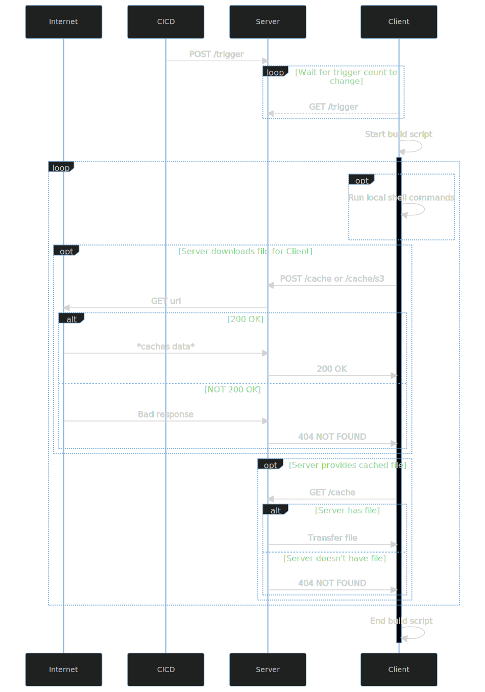

# Overview

[](https://ci.chatha.dev/BradleyChatha/prostagma)
[](https://www.codacy.com/gh/BradleyChatha/prostagma/dashboard?utm_source=github.com&amp;utm_medium=referral&amp;utm_content=BradleyChatha/prostagma&amp;utm_campaign=Badge_Grade)

Prostagma is a webhook-based deployment tool designed to fit into your CICD pipeline.

TL;DR: Agents/clients constantly poll a server for the trigger count of a named trigger which the CICD pipeline can increment. When
the trigger count differs from the last known count, the agents will execute a deployment script.

## Architecture and flow

I feel this is best described via a graph



## Server

The server is a stateless application that stores a Key-Value mapping, where the key is the name of a trigger, and the value is how many
times that trigger has been incremented since the server last started.

The server is configured with a secret (see [deployment](#deployment)) which can then be used by your CICD pipeline and clients to access
the server.

Triggers are automatically created as they are requested/incremented, so no need for preconfiguration.

By sending a request like the following, you can increment a trigger's count:

```json
POST my-prostagma-server/trigger
{
    "secret": "abc123",
    "trigger": "MY_TRIGGER_NAME"
}
```

This will increment `MY_TRIGGER_NAME`'s count by 1.

From a pipeline perspective, it's pretty easy to do this via curl:

```bash
curl -X POST -d '{"secret": "'$PROSTAGMA_SECRET'", trigger: "MY_TRIGGER_NAME"}' http://my.prostagma.server/trigger
```

The server also provides a prometheus endpoint, at the usual `/metrics` path. This path is unprotected as prostagma is supposed
to be an internal service. If you want to protect `/metrics` then configure your reverse proxy to disallow public internet access.

In fact, just to be safe, if all of your prostagma clients can access the server via a prviate network, then the only endpoint that
needs to be exposed (assuming your CICD isn't part of the private network) is the `POST /trigger` endpoint.

If you want the server to able to download S3 objects for its clients (see [aws integration](#aws-integration) and [deployment](#deployment)) then you need to specify the usual `AWS_ACCESS_KEY_ID`, `AWS_SECRET_ACCESS_KEY`, and `AWS_DEFAULT_REGION` environment variables when starting up the server.

## Client

The client is a lightweight, single-file executable that is responsible for polling the server for changes to its trigger, and
then triggering a build script when appropriate.

There can be multiple clients on the same machine, and is actually sort of mandatory since 1 client only has 1 trigger and 1 build script.

When the client starts up, it gets the current value of its trigger from the server. Then, every 5 seconds, it'll check if the trigger's value is *not equal* to the last known value of the trigger. If there's a change in value, the build script is triggered and then it waits for another change in the trigger's value.

A build script is a simple YAML file, which is detailed in the [build script][#build-script] section.

The client is configured via enviroment variables. See the [deployment](#deployment) section for more information.

## Build script

The build script is a simple YAML file with the following structure:

```yaml
steps:
    - shell: str
    - shell: |
        str1
        str2
    - download:
      cache: false
      url: https://raw.githubusercontent.com/BradleyChatha/jcli/master/meson.build
      dest: test_download.yaml
    - download_s3:
      cache: false
      url: s3://bradley-chatha/artifacts/prostagma.zip
      dest: /prostagma.zip
```

In other words, it's a simple `command[]` called `steps`. Commands are executed top-to-bottom, and the same command type can appear
as many times as you want.

Here's an example deployment script for one of my microservices:

```yaml
steps:
  - download_s3:
      cache: false
      url: s3://bradley-chatha/artifacts/chwilwr_dist.zip
      dest: /chwilwr_dist.zip
  - shell: |
      unzip -o /chwilwr_dist.zip -d /usr/bin/
      rm /chwilwr_dist.zip
      sudo systemctl daemon-reload
      sudo systemctl restart chwilwr
      sudo systemctl enable chwilwr
```

### shell

This is a simple command that runs each line in the configured shell.

```yaml
steps:
    - shell: echo abc
    - shell: |
        echo easy as
        echo 1 2 3 
```

### download

Asks the *server* to download a file and then transfer that file to the client.

This is very useful for when clients are sitting on machines that don't have public internet access, but the server itself does.

```yaml
steps:
    - download:
        cache: false # If true, then the server will cache the result instead of downloading the file multiple times
        url: https://cute.catz/1.png
        dest: /var/www/static/images/cats/1.png
```

### download_s3

Asks the *server* to download an S3 object via the aws CLI, and then transfer that file to the client.

For this to work you must have the AWS CLI installed on the same machine/docker image as the prostagma server, and you must have
also configured the CLI via `aws configure` or via environment options (see [deployment](#deployment)).

```yaml
steps:
    - download:
        cache: false # If true, then the server will cache the result instead of downloading the file multiple times
        url: s3://catz-org/images/1.png
        dest: /var/www/static/images/cats/1.png
```

## Deployment

There are two ways to deploy the server and client: manually or via Docker.

### Environment variables

Both the server and client are configured via environment variables.

Common:

* `PROSTAGMA_HOST` - e.g. `0.0.0.0:6969` or `https://prostagma.company.com:6969` - For clients, this is the server to connect to. For servers, this is the address to listen on.
* `PROSTAGMA_SECRET` - e.g. `prostagma` - This is the shared secret used by clients and your CICD pipeline.

Client:

* `PROSTAGMA_SHELL`- e.g. `/bin/sh` - This is the absolute path to the shell to use for the `shell` command.
* `PROSTAGMA_PROM_PORT` - e.g. `7000` - This is the port to host the client's prometheus endpoint on.
* `PROSTAGMA_TRIGGER` - e.g. `mytrigger` - This is the name of the trigger to use for this client.
* `PROSTAGMA_SCRIPT` - e.g. `/deploy.yaml` - This is the absolute path to the build script to execute when the client is triggered.

Server:

* `PROSTAGMA_AWS` - e.g. `/usr/bin/aws` - This is the absolute path to the AWS cli to use for the `download_s3` command.

AWS CLI (the server doesn't use these directly, but indirectly via the AWS CLI):

* `AWS_ACCESS_KEY_ID` - This is used by the AWS cli. This is your IAM access key.
* `AWS_SECRET_ACCESS_KEY` - This is used by the AWS cli. This is your IAM secret key.
* `AWS_DEFAULT_REGION` - This is used by the AWS cli. This is the region to operate in.

### Manually (Server)

Grab the latest [release](https://bradley-chatha.s3.eu-west-2.amazonaws.com/artifacts/prostagma_dist.zip) or download it via curl:

```bash
curl https://bradley-chatha.s3.eu-west-2.amazonaws.com/artifacts/prostagma_dist.zip -o prostagma_dist.zip
unzip prostagma_dist.zip
rm prostagma_dist.zip
mv prostagma /usr/local/bin/prostagma
```

Setup your environment variables for the server:

```bash
export PROSTAGMA_HOST=0.0.0.0:6969
export PROSTAGMA_SECRET=prostagma
export PROSTAGMA_AWS=/usr/bin/aws
export AWS_ACCESS_KEY_ID=...
export AWS_SECRET_ACCESS_KEY=...
export AWS_DEFAULT_REGION=eu-west-2
```

Then create the server:

```bash
/usr/local/bin/prostagma server
```

### Manually (Client)

Grab the latest release (see server deployment).

Setup your environment variables for the client:

```bash
export PROSTAGMA_HOST=http://my-server:6969
export PROSTAGMA_SECRET=prostagma
export PROSTAGMA_SHELL=/usr/bin/sh
export PROSTAGMA_PROM_PORT=7000
export PROSTAGMA_TRIGGER=test
export PROSTAGMA_SCRIPT=/deploy.yml
```

Then create the client:

```bash
/usr/local/bin/prostagma client
```

### Manually as a service

Create a systemd unit (e.g. at `/etc/systemd/system/my_prostagma_client.service`):

```systemd
[Unit]
Description=myproject Prostagma
After=network.target

[Service]
Type=simple
Restart=always
RestartSec=1
User=root
WorkingDirectory=/usr/bin
Environment=PROSTAGMA_HOST=https://prostagma.my.com
Environment=PROSTAGMA_SECRET=ENTER_YOUR_SECRET_HERE
Environment=PROSTAGMA_TRIGGER=myproject
Environment=PROSTAGMA_SCRIPT=/update_myproject.yaml
Environment=PROSTAGMA_SHELL=/usr/bin/sh
Environment=PROSTAGMA_PROM_PORT=7000
ExecStart=/usr/bin/sh -c '/usr/bin/prostagma client >> /var/log/myproject-prostagma.log 2>&1'
AmbientCapabilities=CAP_NET_BIND_SERVICE

[Install]
WantedBy=multi-user.target
```

### Docker (Server)

Add in the AWS CLI env vars if you need them:

```bash
docker run -e PROSTAGMA_HOST=0.0.0.0:6969 \
           -e PROSTAGMA_SECRET=test \
           -p 6969:6969 \
           --name=prostagma-test-server \
           -d \
           -t bradleychatha/prostagma:latest prostagma server
```

### Docker (Client)

Same as above:

```bash
docker run -e PROSTAGMA_HOST=http://127.0.0.1:6969 \
           -e PROSTAGMA_SECRET=test \
           -e PROSTAGMA_TRIGGER=test \
           -e PROSTAGMA_SCRIPT=/build.yaml \
           -e PROSTAGMA_PROM_PORT=7000 \
           -v /build.yaml:/build.yaml \
           -p 7000:7000 \
           --name=prostagma-test-client \
           -d \
           -t bradleychatha/prostagma:test prostagma client
```

## Examples

Here are some example build scripts.

### Download from S3 and update systemd service

```yaml
# In this case, the systemd service was installed before-hand via Ansible.
steps:
  - download_s3:
      cache: false
      url: s3://bradley-chatha/artifacts/chwilwr_dist.zip
      dest: /chwilwr_dist.zip
  - shell: |
      unzip -o /chwilwr_dist.zip -d /usr/bin/
      rm /chwilwr_dist.zip
      sudo systemctl daemon-reload
      sudo systemctl restart chwilwr
      sudo systemctl enable chwilwr
```

Can't be deployed via Docker since it needs access to the host's `systemctl`.

### Download latest static website deployment

```yaml
# In this case, there's a webserver serving from /var/www/personal
# So all we need to do is update the files there.
steps:
  - shell: |
      rm -rf /var/www/personal/
      mkdir /var/www/personal/
  - download_s3:
      cache: false
      url: s3://bradley-chatha/website/dist.zip
      dest: /var/www/personal/personal.zip
  - shell: |
      unzip -o /var/www/personal/personal.zip -d /var/www/personal
      rm /var/www/personal/personal.zip
```

This one is deployed via Docker since we don't need access to anything host-specific, except for the `/var/www/` folder,
which Docker can provide via volume bindings.

```bash
docker run -e PROSTAGMA_HOST=http://prostagma.chatha.dev \
           -e PROSTAGMA_SECRET= \
           -e PROSTAGMA_TRIGGER=website \
           -e PROSTAGMA_SCRIPT=/deploy.yaml \
           -e PROSTAGMA_PROM_PORT=7000 \
           -v /deploy.yaml:/deploy.yaml \
           -v /var/www/:/var/www \
           -p 7000:7000 \
           -d \
           -t bradleychatha/prostagma:test prostagma client
```