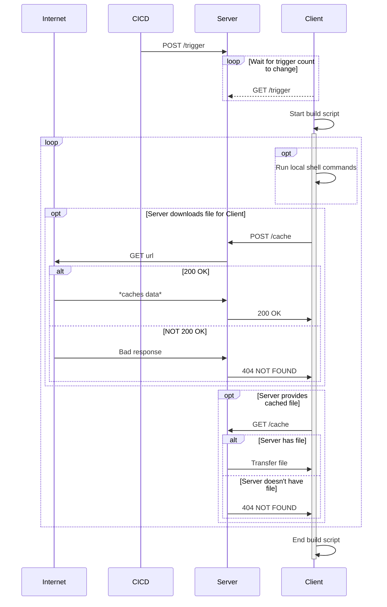

```mermaid
sequenceDiagram
    participant Internet
    participant CICD
    participant Server
    participant Client

    CICD ->> Server: POST /trigger

    loop Wait for trigger count to change
        Client -->> Server: GET /trigger 
    end

    Client ->>+ Client: Start build script

    loop
        opt 
            Client ->> Client: Run local shell commands 
        end

        opt Server downloads file for Client
            Client ->> Server: POST /cache
            Server ->> Internet: GET url
            alt 200 OK
                Internet ->> Server: *caches data*
                Server ->> Client: 200 OK
            else NOT 200 OK
                Internet ->> Server: Bad response
                Server ->> Client: 404 NOT FOUND
            end
        end

        opt Server provides cached file
            Client ->> Server: GET /cache
            alt Server has file
                Server ->> Client: Transfer file
            else Server doesn't have file
                Server ->> Client: 404 NOT FOUND
            end
        end
    end

    Client ->>- Client: End build script
```